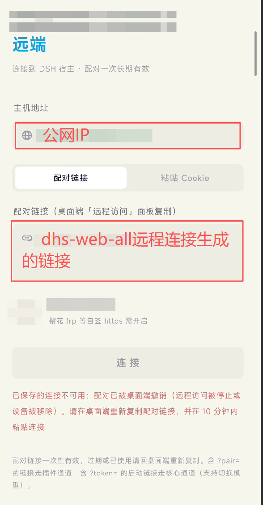

# DSH Mobile · DeepSeek Harness 移动端

**中文** · [English](#english)

纯原生 Android 客户端（Kotlin + Jetpack Compose），把 DeepSeek Harness（DSH）桌面宿主装进口袋：**对话流式输出、LaTeX 公式、图片上传、模型切换、会话归档**，全部原生实现——不加载任何 Web 页面。

App 只依赖 DSH 的**稳定核心接口**与 [dsh-web-all](#与-dsh-web-all-插件配合使用) 插件的手机通道，对桌面端 UI 的任何改动免疫。

---

## ✨ 功能

| | |
|---|---|
| 🔄 **实时流式输出** | WebSocket 多路复用 + 断线重连 + 轮询兜底，seq 水位去重 |
| ⌨️ **打字机渲染** | 生成中按 45ms 步进显示，滚动回收不重放 |
| 📐 **LaTeX 公式** | Markwon + JLaTeXMath，行内 `$...$` 与块级 `$$...$$` |
| 💬 **对话管理** | 工作区分组、新建、切换、**归档**（长按对话）、桌面端删除自动同步 |
| 🖼 **图片上传** | Photo Picker → base64 → 随消息发送，本端即时可见 |
| 🧠 **思考与工具折叠** | reasoning / tool call 可折叠展示 |
| 🤖 **智能体预设** | 圆形矩阵选择器，新建对话即生效 |
| 🔀 **双发送模式** | 插话（steer）/ 排队（queue） |
| 🧩 **模型切换** | 读取宿主模型目录，支持 reasoning effort |
| 🔐 **安全存储** | 配对 cookie 经 AndroidKeyStore AES-256/GCM 加密落盘 |

## 📦 构建

- Android Studio（Ladybug+）/ JDK 17 / Android SDK 36
- minSdk 30 · targetSdk 36 · Kotlin 2.2.10 · AGP 8.13.2

```bash
git clone https://github.com/<you>/dsh-mobile.git
cd dsh-mobile
./gradlew assembleDebug          # Windows: gradlew.bat assembleDebug
# 产物: app/build/outputs/apk/debug/app-debug.apk
./gradlew :app:testDebugUnitTest # 折叠逻辑单元测试
```

## 🚀 快速开始

1. 桌面端安装 **DSH Desktop** 与 [dsh-web-all](https://github.com/zhu1090093659/dsh-web) 插件（其手机远端组件为 remote-web-ui），开启「远程访问」并复制 **`?pair=` 配对链接**（经 frp / SakuraFrp 等隧道公网暴露时，链接形如 `https://your-host:47030/pair-accept?pair=…`）。
2. App 连接页粘贴链接；隧道为自签 HTTPS 时打开**「信任该主机证书」**（TOFU：首次连接由一次性配对链接保护）。
3. 点「连接」——配对一次长期有效。



<p align="center"><sub>▲ 连接页填写示例：主机地址填公网地址，配对链接粘贴桌面端 dsh-web-all「远程访问」生成的 <code>?pair=</code> 链接</sub></p>

## 🔌 与 dsh-web-all 插件配合使用

App 的手机通道由 [dsh-web-all](https://github.com/zhu1090093659/dsh-web)（@linxin666）插件提供——它是 DSH 的 Web UI 全家桶聚合插件，本项目依赖其 remote-web-ui 组件的**手机远端通道**。

**0.3.12 起（当前适配版本）**：插件不再提供 0.3.6 的 `/m/api` 手机 BFF，改为 **`/remote` 门控镜像**——配对后 App 的一切请求（RPC 信封不变）都经 `/remote/api/*` 与 `/remote/api/remote.mux` 透传到宿主，两个通道共享同一 RPC 面。**全部功能开箱即用，无需任何插件补丁**：

| App 功能 | 0.3.12 实现方式 | 需要补丁 |
| --- | --- | --- |
| 会话归档（长按 → 归档） | 宿主 RPC `workspace/archiveSession`（回退 dsh-session-archive 插件路由） | ❌ 不需要 |
| 桌面端归档/删除后手机同步 | dsh-session-archive `inventory` 的 `archivedSessionIds` | ❌ 不需要 |

历史资料（0.3.6 运行时补丁的做法、重打与回滚步骤）见 **[PLUGIN_PATCH.md](./PLUGIN_PATCH.md)**（已标注作废）。

### 通道对照（0.3.12）

| 能力 | 插件通道（`?pair=`，推荐） | 核心通道（`?token=` / cookie） |
| --- | --- | --- |
| 对话 / 流式 / 图片 / 模型 / 预设 | ✅ | ✅ |
| 会话归档 + 同步 | ✅ | ✅ |
| 已有会话切换预设 | ✅ | ✅ |
| 会话搜索 | ✅ | ✅ |

> 两通道的差异只剩 URL 前缀（`/remote/api` vs `/api`）与凭据（配对 cookie + 设备 id vs `dsh-auth-` cookie）；0.3.6 时代插件通道的预设切换/搜索限制已随 `/remote` 镜像消失。

## 🔒 安全须知

- **配对 cookie 是全权凭据**：持有它即可完全控制宿主，请勿泄露；桌面端可随时吊销设备。
- 「信任该主机证书」为 TOFU 策略：自签隧道（樱花 frp 等）需要开启；首次连接的安全性由一次性配对链接保证。
- 公网暴露请确保隧道仅转发到 DSH 端口，并定期在桌面端检查已配对设备。

## 🧱 项目结构

```
app/src/main/java/com/example/DSH_Mobile/
├── dsh/          # 传输与协议：双通道 RPC、WS mux、事件折叠（MessageStore）
├── store/        # DataStore + Keystore 加密存储
├── vm/           # AppViewModel / ChatViewModel
└── ui/           # Compose 界面：连接页 / 聊天 / 抽屉 / Flat 设计系统
```

## 📚 更多文档

- [IMPLEMENTATION.md](./IMPLEMENTATION.md) — 已实现的 API 契约（经宿主源码核实）与代码导览
- [PLUGIN_PATCH.md](./PLUGIN_PATCH.md) — dsh-web-all 插件补丁：改动内容、重打步骤、回滚
- [docs/PLAN.zh.md](./docs/PLAN.zh.md) — 最初的设计方案（历史资料）

---

<a id="english"></a>

# DSH Mobile — Native Android Remote Client for DeepSeek Harness

**English** · [中文](#dsh-mobile--deepseek-harness-移动端)

A fully native Android client (Kotlin + Jetpack Compose) that puts your DeepSeek Harness (DSH) desktop host in your pocket: **streaming answers, LaTeX formulas, image uploads, model switching and session archiving** — all rendered natively, no WebViews involved.

The app talks only to DSH's **stable core API** and the mobile channel of the [dsh-web-all](#using-it-with-the-dsh-web-all-plugin) plugin, staying immune to desktop UI changes.

## ✨ Features

- 🔄 **Realtime streaming** — WebSocket mux with auto-reconnect, polling fallback, seq-watermark dedupe
- ⌨️ **Typewriter rendering** — 45 ms stepped reveal; scrolling away never replays it
- 📐 **LaTeX** — Markwon + JLaTeXMath, inline `$...$` and display `$$...$$`
- 💬 **Conversations** — workspace grouping, creation, switching, **archiving** (long-press), sync with desktop deletions
- 🖼 **Image upload** — Photo Picker → base64 → sent with the prompt, visible locally
- 🧠 **Reasoning & tool-call folding**
- 🤖 **Agent presets** — circular grid picker, applied to newly created sessions
- 🔀 **Steer / queue** sending modes
- 🧩 **Model switching** from the host catalog (incl. reasoning effort)
- 🔐 **Encrypted storage** — pairing cookie sealed with AndroidKeyStore AES-256/GCM

## 📦 Build

- Android Studio (Ladybug+) · JDK 17 · SDK 36 · minSdk 30

```bash
git clone https://github.com/<you>/dsh-mobile.git
cd dsh-mobile
./gradlew assembleDebug
# artifact: app/build/outputs/apk/debug/app-debug.apk
./gradlew :app:testDebugUnitTest
```

## 🚀 Quick start

1. On the desktop: install **DSH Desktop** plus the [dsh-web-all](https://github.com/zhu1090093659/dsh-web) plugin (whose remote-web-ui component powers the mobile channel), enable "Remote Access" and copy the **`?pair=` pairing link** (behind an frp tunnel it looks like `https://your-host:47030/pair-accept?pair=…`).
2. Paste it in the app; for self-signed tunnels (SakuraFrp etc.) enable **"Trust this host certificate"** (TOFU — the first connection is protected by the one-time pairing link).
3. Tap **Connect**. Pairing persists.


<p align="center"><sub>▲ Connect screen cheat sheet: put the public host in the first field, paste the <code>?pair=</code> link generated by dsh-web-all's "Remote Access" panel</sub></p>

## 🔌 Using it with the dsh-web-all plugin

The mobile channel is powered by the [dsh-web-all](https://github.com/zhu1090093659/dsh-web) plugin (@linxin666) — an all-in-one DSH Web UI bundle. This project relies on its remote-web-ui component for the **mobile remote channel**.

**Since 0.3.12 (the currently adapted version)** the plugin no longer ships the 0.3.6 `/m/api` mobile BFF; instead it exposes a **gated `/remote` mirror** — after pairing, every app request (same RPC envelope) rides `/remote/api/*` and `/remote/api/remote.mux` into the host, so both channels share one RPC surface. **Everything works out of the box, no plugin patch required**:

| App feature | 0.3.12 implementation | Patch needed |
| --- | --- | --- |
| Session archiving (long-press → archive) | host RPC `workspace/archiveSession` (fallback: dsh-session-archive plugin route) | ❌ no |
| Syncing desktop archives/deletions | dsh-session-archive `inventory` → `archivedSessionIds` | ❌ no |

Historical material (the 0.3.6 runtime patch, re-apply and rollback steps) lives in **[PLUGIN_PATCH.md](./PLUGIN_PATCH.md)** (marked obsolete).

### Channel matrix (0.3.12)

| Capability | Plugin channel (`?pair=`, recommended) | Core channel (`?token=` / cookie) |
| --- | --- | --- |
| Chat / streaming / images / models / presets | ✅ | ✅ |
| Session archive + sync | ✅ | ✅ |
| Switch preset of an existing session | ✅ | ✅ |
| Session search | ✅ | ✅ |

> The channels now differ only in URL prefix (`/remote/api` vs `/api`) and credentials (pairing cookie + device id vs `dsh-auth-` cookie); the 0.3.6-era plugin-channel limitations on preset switching and search are gone with the `/remote` mirror.

## 🔒 Security notes

- **The pairing cookie is a full-control credential** — treat it like a password; the desktop can revoke devices at any time.
- "Trust this host certificate" is a TOFU policy for self-signed tunnels; the first connection is protected by the one-time pairing link.
- When exposing the host publicly, forward only the DSH port and review paired devices regularly.

## 🧱 Project layout

```
app/src/main/java/com/example/DSH_Mobile/
├── dsh/          # transport & protocol: dual-channel RPC, WS mux, event folding
├── store/        # DataStore + Keystore-encrypted cookie
├── vm/           # AppViewModel / ChatViewModel
└── ui/           # Compose screens: connect / chat / drawer / Flat design system
```

## 📚 More docs

- [IMPLEMENTATION.md](./IMPLEMENTATION.md) — verified API contracts and code tour
- [PLUGIN_PATCH.md](./PLUGIN_PATCH.md) — the dsh-web-all plugin patch: what, why, how to re-apply
- [docs/PLAN.zh.md](./docs/PLAN.zh.md) — original design document (historical)
